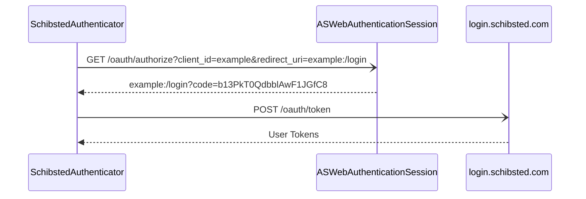
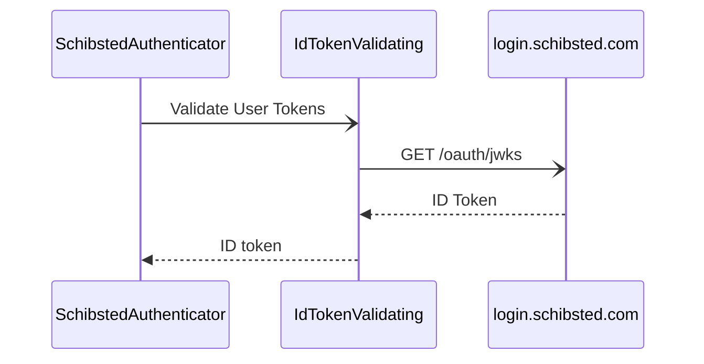
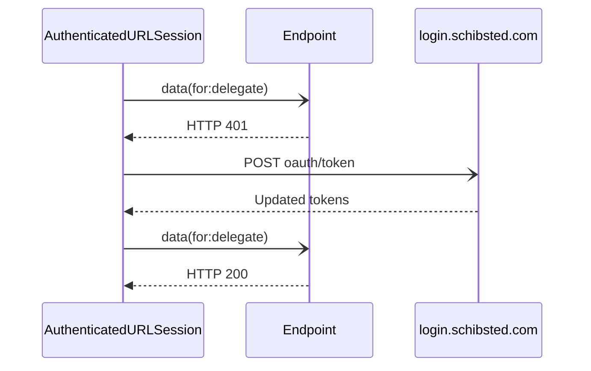
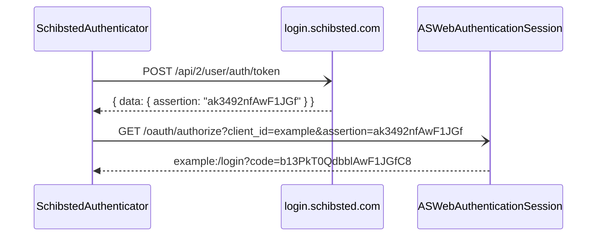

# Technical Documentation

## Login

When logging in, we create a `ASWebAuthenticationSession` with a given URL, and reads the corresponding `code` query parameter when it completes.

The code is then used to [request the user tokens](https://docs.schibsted.io/schibsted-account/guides/tokens/)

Next we perform [local token introspection](https://docs.schibsted.io/schibsted-account/guides/token-introspection/#local-token-introspection) using the Schibsted Account public keys from `/oauth/jwks`

## Token refresh flow

When the `AuthenticatedURLSession` hits a HTTP 401, it'll attempt to refresh the OAuth token, using the stored refresh token.

## Simplified Login

Simplified login uses a user token from a shared keychain to request a `assertion`, which is provided as a query parameter for the URL passed to the `ASWebAuthenticationSession`, in order to login without needing any user input.

